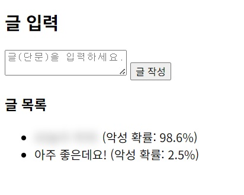
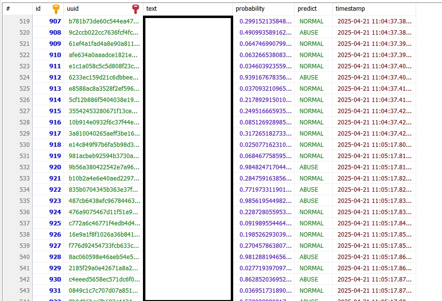
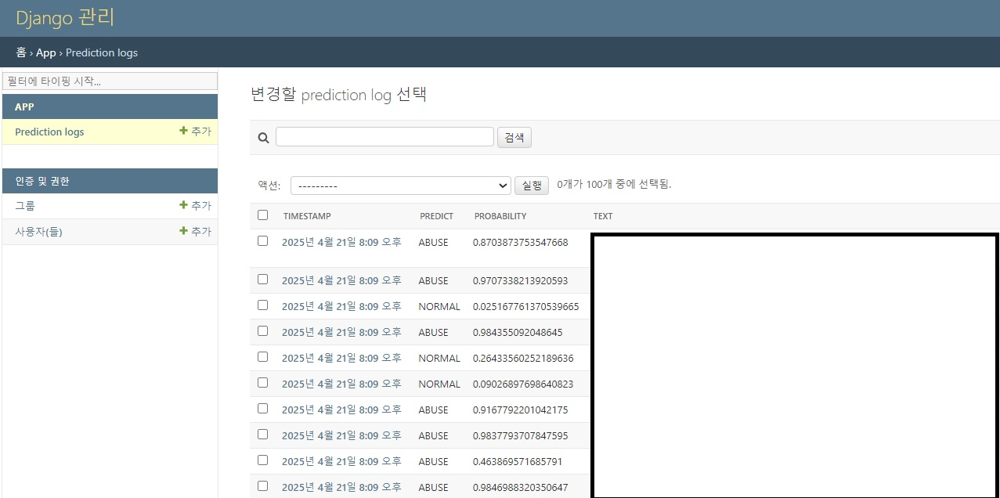

## 프로젝트 이름
- 악성 댓글 탐지 개인 프로젝트

## 프로젝트 기간
- 2025년 3월 28일 ~ 2025년 4월 21일
  - 수정 사항 있으면 추후 수정 예정.

## 프로젝트 진행 상황
- 3/28~3/29: 데이터 수집
- 3/29~3/30: data_loader.py 작성
- 3/29~3/31: preprocess.py 작성
- 3/29~3/31: USER_DICT.dict 구축
- 3/31~4/2: train.py 작성
- 4/2~4/4: detector.py 작성
- 4/3~4/5 : views.py, urls.py, templates/index.html, static/styles.css 작성
- 4/12~4/14: 코드 오류 수정  
- 4/14~4/15: 성능 개선에 대한 고려(threshold 적용)
- 4/14~4/16: KcELECTRA-small-v2022 적용
- 4/14~4/21: 프로젝트 마무리
  - detector.py 보완 (4/14 ~ 4/15)
  - views.py, urls.py, static/styles.css에 대한 전반적인 수정 (4/14 ~ 4/21)
  - blur 처리, tooltip 보완 (4/14 ~ 4/21)
  - 분석 결과 로그를 (중복을 허용하지 않고) DB에 저장할 수 있도록 수정. (4/18 ~ 4/19)
- 4/21: GitHub 업로드

## 프로젝트 설명
- 악성 댓글을 탐지하는 것을 목표로 한 개인 프로젝트.
  - local(index.html과 연관): 댓글을 입력하면 악성인지 아닌지 판단.
  - Chrome(chrome_extension과 연관): Youtube 영상 페이지에 들어가면 댓글을 탐지하여 blur 처리와 악성 확률을 표시.
    - 영상 페이지 접속 후 댓글이 보인 시점부터 대략 5~10초 소요

- 악성의 범위: 욕설이 들어간 댓글, 공격적/차별적인 글
  - 악성의 범위가 다소 광범위하여 많은 글이 악성으로 분류될 수는 있음.

- 개인 프로젝트이고, 개인적으로 사용할 용도이기도 했으므로 프로그램으로 배포하지는 않을 예정.

## 예시 사진

### Local 예시 사진


  - 악성 댓글로 감지되면 흐리게 처리됩니다.
  - 아직 로컬에서의 결과는 DB 연동 대상이 아니며, UI는 보완 예정. 

### Chrome 예시 사진


  - 악성 댓글로 감지되면 흐리게 처리되고, 마우스를 올려놓으면 툴팁이 확률에 따라 다르게 보임.
    - 90% 이상: 빨간색
    - 80% 이상: 주황색
    - threshold 이상: 노란색
  - 툴팁은 마우스를 따라감. 


  - 해당 댓글을 클릭하면 blur 처리와 툴팁이 모두 사라짐.

### DB, Django Admin 예시 사진


  - 분석된 댓글은 DB(MySQL)에 저장되어, 다음 분석에도 활용할 수 있음.
  - 시간은 UTC 기준으로 저장됨.


  - Django Admin에서도 분석 결과를 확인할 수 있음.
  - 시간은 한국 표준시 기준임.


## 프로젝트 구조
```
📦Project
 ┣ 📂AbuseDetection
 ┃ ┣ 📂AbuseDetection
 ┃ ┃ ┣ 📂__pycache__
 ┃ ┃ ┃ ┣ 📜settings.cpython-310.pyc
 ┃ ┃ ┃ ┣ 📜urls.cpython-310.pyc
 ┃ ┃ ┃ ┣ 📜wsgi.cpython-310.pyc
 ┃ ┃ ┃ ┗ 📜__init__.cpython-310.pyc
 ┃ ┃ ┣ 📜asgi.py
 ┃ ┃ ┣ 📜settings.py
 ┃ ┃ ┣ 📜urls.py
 ┃ ┃ ┣ 📜wsgi.py
 ┃ ┃ ┗ 📜__init__.py
 ┃ ┣ 📂app
 ┃ ┃ ┣ 📂dataset
 ┃ ┃ ┃ ┣ 📜dataset.txt
 ┃ ┃ ┃ ┣ 📜dev.tsv
 ┃ ┃ ┃ ┗ 📜train.tsv
 ┃ ┃ ┣ 📂migrations
 ┃ ┃ ┃ ┣ 📂__pycache__
 ┃ ┃ ┃ ┃ ┣ 📜0001_initial.cpython-310.pyc
 ┃ ┃ ┃ ┃ ┣ 📜0002_sentenceinfo_after_preprocessing.cpython-310.pyc
 ┃ ┃ ┃ ┃ ┣ 📜0003_predictionlog.cpython-310.pyc
 ┃ ┃ ┃ ┃ ┗ 📜__init__.cpython-310.pyc
 ┃ ┃ ┃ ┣ 📜0001_initial.py
 ┃ ┃ ┃ ┣ 📜0002_sentenceinfo_after_preprocessing.py
 ┃ ┃ ┃ ┣ 📜0003_predictionlog.py
 ┃ ┃ ┃ ┗ 📜__init__.py
 ┃ ┃ ┣ 📂nlp
 ┃ ┃ ┃ ┣ 📂model_01
 ┃ ┃ ┃ ┃ ┣ 📂__pycache__
 ┃ ┃ ┃ ┃ ┃ ┣ 📜preprocess.cpython-310.pyc
 ┃ ┃ ┃ ┃ ┃ ┗ 📜train.cpython-310.pyc
 ┃ ┃ ┃ ┃ ┣ 📜best_model.pth
 ┃ ┃ ┃ ┃ ┣ 📜config.json
 ┃ ┃ ┃ ┃ ┣ 📜detector.py
 ┃ ┃ ┃ ┃ ┣ 📜preprocess.py
 ┃ ┃ ┃ ┃ ┣ 📜preprocessed_df.csv
 ┃ ┃ ┃ ┃ ┣ 📜train.py
 ┃ ┃ ┃ ┃ ┗ 📜USER_DICT.dict
 ┃ ┃ ┃ ┣ 📂model_02
 ┃ ┃ ┃ ┃ ┣ 📂__pycache__
 ┃ ┃ ┃ ┃ ┃ ┗ 📜detector.cpython-310.pyc
 ┃ ┃ ┃ ┃ ┣ 📜best_KcELECTRA_model.pth
 ┃ ┃ ┃ ┃ ┣ 📜config.json
 ┃ ┃ ┃ ┃ ┣ 📜detector.py
 ┃ ┃ ┃ ┃ ┗ 📜train.py
 ┃ ┃ ┃ ┣ 📂__pycache__
 ┃ ┃ ┃ ┃ ┣ 📜detector.cpython-310.pyc
 ┃ ┃ ┃ ┃ ┣ 📜preprocess.cpython-310.pyc
 ┃ ┃ ┃ ┃ ┣ 📜train.cpython-310.pyc
 ┃ ┃ ┃ ┃ ┗ 📜__init__.cpython-310.pyc
 ┃ ┃ ┃ ┗ 📜__init__.py
 ┃ ┃ ┣ 📂scripts
 ┃ ┃ ┃ ┣ 📜data_loader.py
 ┃ ┃ ┃ ┗ 📜__init__.py
 ┃ ┃ ┣ 📂static
 ┃ ┃ ┃ ┗ 📜styles.css
 ┃ ┃ ┣ 📂templates
 ┃ ┃ ┃ ┗ 📜index.html
 ┃ ┃ ┣ 📂__pycache__
 ┃ ┃ ┃ ┣ 📜admin.cpython-310.pyc
 ┃ ┃ ┃ ┣ 📜apps.cpython-310.pyc
 ┃ ┃ ┃ ┣ 📜models.cpython-310.pyc
 ┃ ┃ ┃ ┣ 📜urls.cpython-310.pyc
 ┃ ┃ ┃ ┣ 📜views.cpython-310.pyc
 ┃ ┃ ┃ ┗ 📜__init__.cpython-310.pyc
 ┃ ┃ ┣ 📜admin.py
 ┃ ┃ ┣ 📜apps.py
 ┃ ┃ ┣ 📜models.py
 ┃ ┃ ┣ 📜urls.py
 ┃ ┃ ┣ 📜views.py
 ┃ ┃ ┗ 📜__init__.py
 ┃ ┣ 📜.env
 ┃ ┗ 📜manage.py
 ┣ 📂chrome_extension
 ┃ ┣ 📜config.js
 ┃ ┣ 📜content.js
 ┃ ┗ 📜manifest.json
 ┣ 📂examples
 ┃ ┣ 📜example_chrome_1.jpg
 ┃ ┣ 📜example_chrome_2.jpg
 ┃ ┣ 📜example_db_1.jpg
 ┃ ┣ 📜example_django_1.jpg
 ┃ ┗ 📜example_local_1.jpg
 ┣ 📜.gitignore
 ┣ 📜LICENSE
 ┣ 📜README.md
 ┣ 📜requirements.txt
 ┗ 📜THIRD_PARTY_LICENSES.md
 ```


## 📜 License

This project is licensed under the **MIT License** – see the [LICENSE](./LICENSE) file for details.

### 📂 Third-party Libraries and Datasets

This project makes use of the following third-party resources:

1. **Curse-detection-data**  
   - License: MIT  
   - URL: https://github.com/2runo/Curse-detection-data  

2. **Korean HateSpeech Dataset**  
   - License: CC-BY-SA-4.0  
   - URL: https://github.com/kocohub/korean-hate-speech  

3. **kiwipiepy**  
   - License: LGPL v3  
   - URL: https://github.com/bab2min/kiwipiepy  

4. **transformers (by Hugging Face)**  
   - License: Apache 2.0  
   - URL: https://github.com/huggingface/transformers  

5. **KcELECTRA-small-v2022**  
   - License: MIT  
   - URL: https://huggingface.co/beomi/KcELECTRA-small-v2022  

See [THIRD_PARTY_LICENSES](./THIRD_PARTY_LICENSES.md) for more details.
